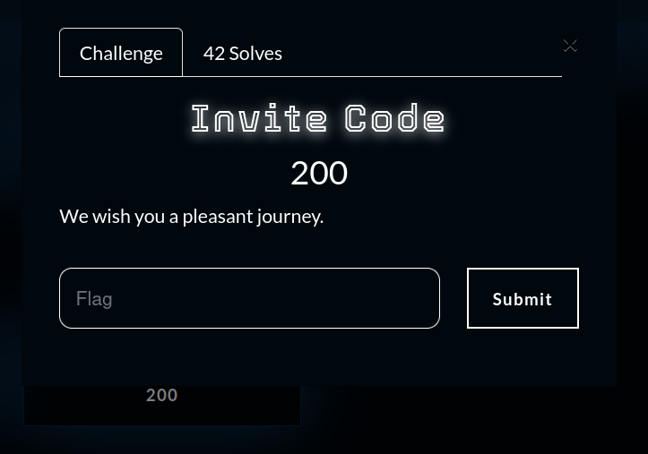
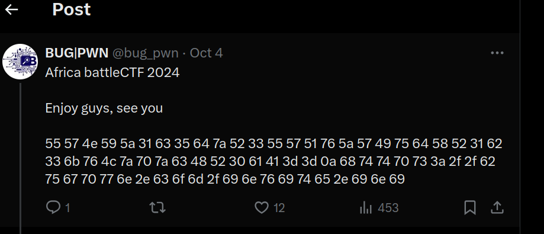
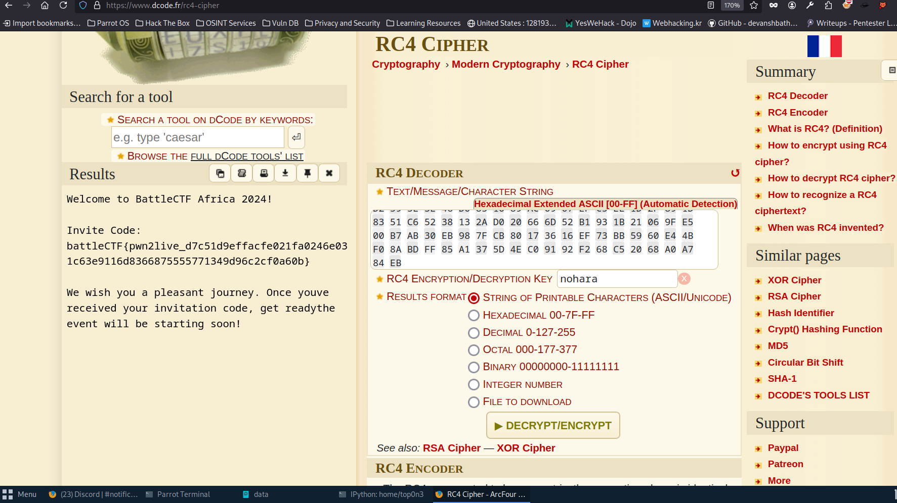

# chall Name: Invite Code 



# chall description:
```
    Africa battleCTF 2024 

    Enjoy guys, see you

    55 57 4e 59 5a 31 63 35 64 7a 52 33 55 57 51 76 5a 57 49 75 64 58 52 31 62 33 6b 76 4c 7a 70 7a 63 48 52 30 61 41 3d 3d 0a 68 74 74 70 73 3a 2f 2f 62 75 67 70 77 6e 2e 63 6f 6d 2f 69 6e 76 69 74 65 2e 69 6e 69
```



an hex string. so let convert it to printable text:

```python3
bytes.fromhex("55 57 4e 59 5a 31 63 35 64 7a 52 33 55 57 51 76 5a 57 49 75 64 58 52 31 62 33 6b 76 4c 7a 70 7a 6    3 48 52 30 61 41 3d 3d 0a 68 74 74
   ...:  70 73 3a 2f 2f 62 75 67 70 77 6e 2e 63 6f 6d 2f 69 6e 76 69 74 65     2e 69 6e 69".replace(" ", ''))
Out[1]: b'UWNYZ1c5dzR3UWQvZWIudXR1b3kvLzpzcHR0aA==\nhttps://bugpwn.com/invite.ini'
```
so we get a base64 encoded string "UWNYZ1c5dzR3UWQvZWIudXR1b3kvLzpzcHR0aA=="  and an url "https://bugpwn.com/invite.ini"

``` echo UWNYZ1c5dzR3UWQvZWIudXR1b3kvLzpzcHR0aA== | base64 -d
QcXgW9w4wQd/eb.utuoy//:sptt
```
youtub link reversed: QcXgW9w4wQd/eb.utuoy//:sptt = https://youtu.be/dQw4w9WgXcQ

the link redirect to never give up video.

### let focus on the second url: https://bugpwn.com/invite.ini 

when you visit it, you get this text:
```
H4sIAKvQ/2YC/02TW08bQQyFn+FXHCKk9iXN3C9SEjS7MytVlIsAqUKKVC1JgJRk0yahTf997VC1fUBMduzj48+eh3eTfTud7OezyV4I+rO795N90MOz/WqJH/PNdrHuRj35QfQw76br2aJ7GvVed4/90MN213azdrnu5qNet+7hbHw8PMlX9d39dcHrlpJxe397Vy5AF2+/V+1+1AuyNz4+Onyhm6Oj4XL9tOi6djUfP7S73XI+3T0OB/8+csi3drv9ud7MxqeqPZXqdD59Xcjl3eri8/nNxY35OjPm5fHq5XoflvP2k9id18/d5WJmlpfp4XkzuH++vt5/Hw7+yrCmmW6+UFObX992Y2FhGygHbxArhIzsISJMRKngJKKBzRAePkNqpIQS4C3qDJcgC3yEVMiHc6BbD9WwZiY1j2IgSFNxLp2DQimQAqlG8tAJFQUbVArJIFloh5KgakgHIRAiUkEVoBREhcZCBtQJQkMr1HR2cBVsQBAoNbyA93CF020N67iia5Ayp9cWkW6ptciapnDpKBAtqgomo2T2HCNiYGMkmA2K4r6oC0r3jkuzKwcpkSp4DeeRBDMhq7pGoHYcQ1OSg73kWjlyjCakZFvAVn+gkckouaiMcBriwIHCBBkjA4Kdk7ImZWKu0VAi9VtQEw3SSYwxVMjNARcdyADhItsNGsO068JVSLPRUILh1wpWcYr1PBobWZBKGIdMIpZjuMeaN4FGT1LUOw8u83Dpig5Bw0rmT1I68HxV4nQq4Wgomb9XtD+aDTMKd+jIss/KMzoteMcItW+4HZqg9LwANDuqSGBpKOTNCd4cc+iXBlFlNA2bTBLaM2eaIyEljFGhoXEHdss2AjNnPsShGg7+33t6hwN+iPRCD/+348lm0g1P+n28vcX6jramuflIy6YE4ez3DxG/AVECNBs5BAAA
```
after base64 decoding  this string, i realize that it start with (\x1f\x8b) : gzip file magic number
so i confirm that this is a gzip file. i wrote this script to get the claire content :

```python3
import base64
import gzip
import io
base64_data = "H4sIAKvQ/2YC/02TW08bQQyFn+FXHCKk9iXN3C9SEjS7MytVlIsAqUKKVC1JgJRk0yahTf997VC1fUBMduzj48+eh3eTfTud7OezyV4I+rO795N90MOz/WqJH/PNdrHuRj35QfQw76br2aJ7GvVed4/90MN213azdrnu5qNet+7hbHw8PMlX9d39dcHrlpJxe397Vy5AF2+/V+1+1AuyNz4+Onyhm6Oj4XL9tOi6djUfP7S73XI+3T0OB/8+csi3drv9ud7MxqeqPZXqdD59Xcjl3eri8/nNxY35OjPm5fHq5XoflvP2k9id18/d5WJmlpfp4XkzuH++vt5/Hw7+yrCmmW6+UFObX992Y2FhGygHbxArhIzsISJMRKngJKKBzRAePkNqpIQS4C3qDJcgC3yEVMiHc6BbD9WwZiY1j2IgSFNxLp2DQimQAqlG8tAJFQUbVArJIFloh5KgakgHIRAiUkEVoBREhcZCBtQJQkMr1HR2cBVsQBAoNbyA93CF020N67iia5Ayp9cWkW6ptciapnDpKBAtqgomo2T2HCNiYGMkmA2K4r6oC0r3jkuzKwcpkSp4DeeRBDMhq7pGoHYcQ1OSg73kWjlyjCakZFvAVn+gkckouaiMcBriwIHCBBkjA4Kdk7ImZWKu0VAi9VtQEw3SSYwxVMjNARcdyADhItsNGsO068JVSLPRUILh1wpWcYr1PBobWZBKGIdMIpZjuMeaN4FGT1LUOw8u83Dpig5Bw0rmT1I68HxV4nQq4Wgomb9XtD+aDTMKd+jIss/KMzoteMcItW+4HZqg9LwANDuqSGBpKOTNCd4cc+iXBlFlNA2bTBLaM2eaIyEljFGhoXEHdss2AjNnPsShGg7+33t6hwN+iPRCD/+348lm0g1P+n28vcX6jramuflIy6YE4ez3DxG/AVECNBs5BAAA"

raw_data = base64.b64decode(base64_data)
with gzip.GzipFile(fileobj=io.BytesIO(raw_data)) as f:
    decompressed_data = f.read()
print(decompressed_data.decode('utf-8'))

```
# execute it and i get this :
```
b'\xac\xed\x00\x05t(\x83<?xml version="1.0" encoding="utf-8" standalone="no" ?>
<!DOCTYPE users SYSTEM >
<users max="81">
	<user >
		<loginname>battlectf</loginname>
		<password>$2a$12$ecui1lTmMWKRMR4jd44kfOkPx8leaL0tKChnNid4lNAbhr/YhPPxq</password>
		<4cr_encrypt>05 5F 26 74 9B 8D D7 09 49 EB 61 94 5D 07 7D 13 AA E8 75 CD 6A 1E 79 12 DA 1E 8A E7 2F 5F DB 87 E4 0D D2 13 E4 82 EE 10 AC A7 3A BF 54 B2 A4 A5 36 EA 2C 16 00 89 AE B8 22 0B F5 18 CA 03 32 C8 C6 6B 58 80 EC 70 77 6E 16 5C 56 82 6F AD 0B C5 97 69 E9 B8 4E 54 90 95 BB 4D ED 87 99 98 BF EC D4 E2 8A 0D C5 76 03 89 A6 11 AB 73 67 A0 75 AE 3C 84 B6 5D 21 03 71 B8 D9 A0 3B 62 C0 5B 12 DA 5C 91 87 19 63 02 A4 3B 04 9F E0 AD 75 3E 35 C3 FB 1B 5E CB F0 5A A7 8B DF 00 8B DC 88 24 EF F4 EE CE 5C 3B F3 20 10 C2 52 DF 57 D2 59 5E 3E 46 D0 85 10 89 AC 09 07 EF C5 EE 1D 2F 89 1D 83 51 C6 52 38 13 2A D0 20 66 6D 52 B1 93 1B 21 06 9F E5 00 B7 AB 30 EB 98 7F CB 80 17 36 16 EF 73 BB 59 60 E4 4B F0 8A BD FF 85 A1 37 5D 4E C0 91 92 F2 68 C5 20 68 A0 A7 84 EB</4cr_encrypt>
	</user>
</users>\r\n<!-- battleCTF AFRICA 2024 -->\r\n
```

in this xml content, we have:
bcrypted password: $2a$12$ecui1lTmMWKRMR4jd44kfOkPx8leaL0tKChnNid4lNAbhr/YhPPxq
and some other hex value in <4cr_encrypt> tag

after some google, i found multiple articles aboute CR4 encryption i i knew that the hex string is cr4 encryted text, so i need the password to decrypt it.

# where can i get the password to do that?? bcrypt hash???

#### let focus on bcrypt hash.
i used hashcat. as my computer is not powerfull, i launch the command and go to bed.

at the morning, i got cracked :-)
```
hashcat -m 3200  -a 0 hash.txt  --show
$2a$12$ecui1lTmMWKRMR4jd44kfOkPx8leaL0tKChnNid4lNAbhr/YhPPxq:nohara
```
so the passsword is : nohara

with that: we can  decrypt cr4 encoded string: i did it on dcode.




# end we get the flag: battleCTF{pwn2live_d7c51d9effacfe021fa0246e031c63e9116d8366875555771349d96c2cf0a60b}

