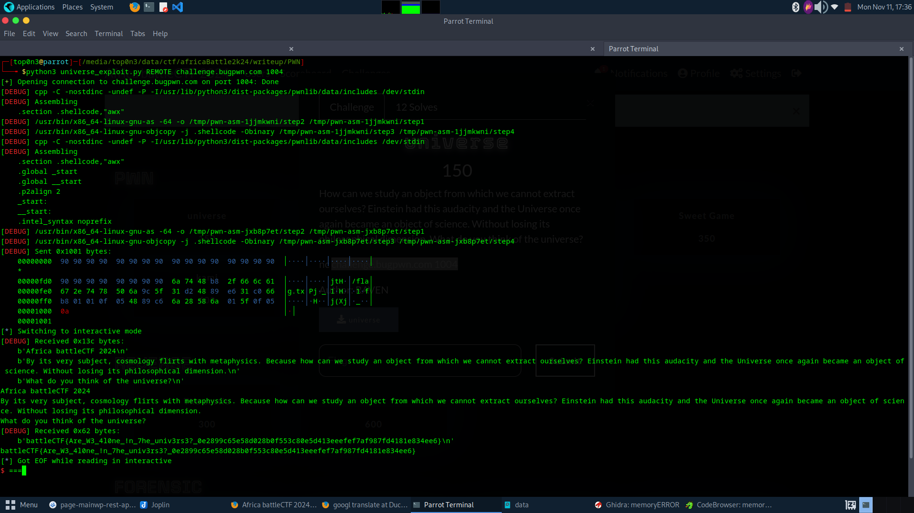

# challname: universe 

# check mitigation:

by using strace, we can see that the prog use seccomp. 

# decompilte the prog with ghidra:

through  decompiled code, we can see that the main function 
allocate memory array of 0x1000 length with exec perm  using mmap.
after that it print some text on the terminal and call seccomp_filter( i named it ) .
it also read 0x1000 byte on local variable named shellcode(i named it)  and execute it.
shellcode  pointe to  mmap return  address
finally the prog execute shellcode.

this is a resume:
1. ask user to input shellcode of 0x1000 length
2. call some seccomp filter
3. execute user input shellcode 

# so to exploit this prog, we must make shellcode injection.
but before that, let understant what seccomp rules filter.

so the filter is something like that:
1. no open syscall
2. no clone syscall
3. no fork syscall
4. no vfork syscall
5. no execve syscall
6. no creat syscall
7. no execveat syscall

# remember our purpose is to read the flag
so how to do that???
after some google and reading writeup about seccomp filters,
i realize that we can use ``openat`` syscall  to open a file and ``sendfile``  to send it contain to the terminal.

# so let do it:
see the complet exploit

# NB : i didn't solve the chall during the competition because the location of the flag must be guessed. i try to read flag at ./flag, flag, .flag, ../flag, /etc/flag and i get nothing. so i sopped here.      the flag location was /flag :-) very sad. 

# and we get the flag: battleCTF{Are_W3_4l0ne_!n_7he_univ3rs3?_0e2899c65e58d028b0f553c80e5d413eeefef7af987fd4181e834ee6}

