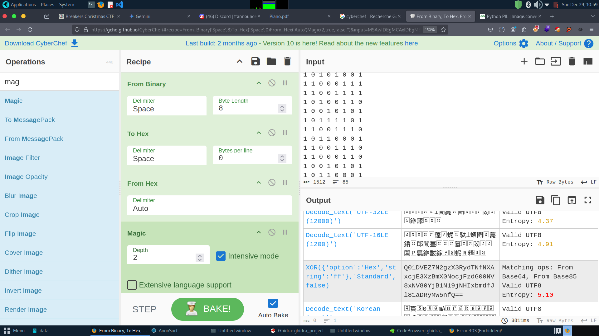
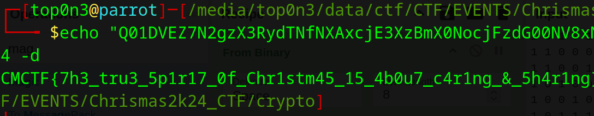

```
 Pictorial Piano
100

Un espion pixélisé a volé le leitmotiv du Père Noël et a laissé cet étrange motif en guise d'indice. Pourrez-vous déchiffrer le drapeau caché et sauver Noël ?

Author: afrinic

```
we are given a png file png file


as the challenge talk about pixel, we have to deal with image pixel.

After a long time triage and error , i write a simple python script to convert all pixel of the image
- if the pixel is white, i convert it to 1 otherwise, i convert it to 0:
i used python pillow module to do that

```python
from PIL import Image
img = Image.open("../images/piano.png").convert("1")  # open image file
img_pixels = img.load() # get image pixel
# loop through image pixel and print 1 if pixel is white otherwise 0
for i in range(img.height):
    for j in range(img.width):
        pixel = img_pixels[j,i]
        print(1 if pixel==255 else 0,end=' ')
    print(" ") # new line


```
        
after run the script, i got the binary list represented the image pixel.
i use cyberchef to convert the binary text to string and after that, use magic option to see if i can get the flag.


i don't got the flag . but i got a base64 strings "Q01DVEZ7N2gzX3RydTNfNXAxcjE3XzBmX0NocjFzdG00NV8xNV80YjB1N19jNHIxbmdfJl81aDRyMW5nfQ==" that  i decode to get the flag



# flag: CMCTF{7h3_tru3_5p1r17_0f_Chr1stm45_15_4b0u7_c4r1ng_&_5h4r1ng} 
