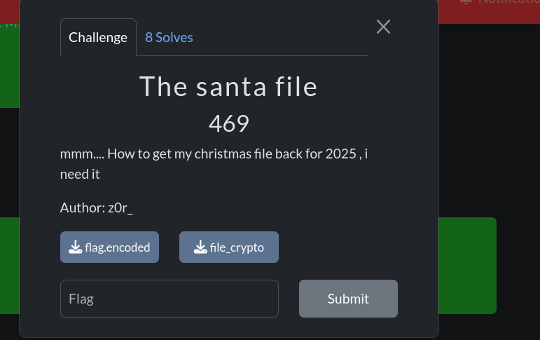
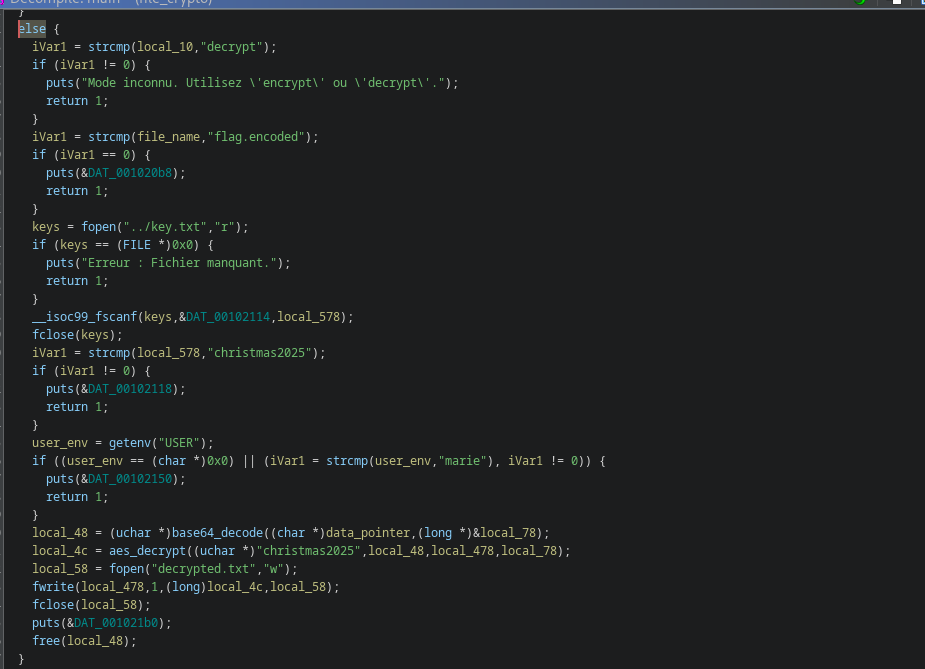

# challenge name: santa file



# what file is it:
```bash
file file_crypto 
file_crypto: ELF 64-bit LSB pie executable, x86-64, version 1 (SYSV), dynamically linked, interpreter /lib64/ld-linux-x86-64.so.2, BuildID[sha1]=5d2f6456da9ee4bcf0c7347df9d23229fdd9ccb3, for GNU/Linux 3.2.0, not stripped
```
ELF 64-bits Least significante bit, Not stripped (so easy for reverse

```bash
/file_crypto 
Usage : ./file_crypto [encrypt|decrypt] <filename>
```
with that usage message, we can get a little ideal about the program work:
decrypt of encrypt a file

when i try to decrypt the flag.encoded file, i can  an error message
``` bash
./file_crypto decrypt  flag.encoded 
Erreur : Vous ne pouvez pas déchiffrer ce fichier.
```
# let decompile  the prog  with ghidra to understand how it work
the part that interest me is decrypt function


## how it work??
when we use decrypt option, the program check:
- if the file name you wanna  decrypt is flag.encoded. if so, it exit with error message
- else if we have  key.txt file in the parent directory. if not, it exit with error message
- otherwise, it read the key on ../key.txt and compare it to christmas2025.
- if the key don't match, it exit with error  message
- otherwise, the prog get USER env variable, it USER environment variable is equal to  marie, the prog  decrypt the content of the file you specify and store it in decrypted.txt


** so with that, we know what we can do to decrypt the content of flag.encoded
1 - rename flag.encoded to other name: ``` mv flag.encoded encoded_flag.txt```
2 - create key.txt in the parent directory and input "chrismas2025" on it: ``` echo chrismas2025 > ../key.txt```
3 set environment variable USER to "marie": ```export USER=marie"
4 - now decrypt encoded_flag.txt: ```file_crypto decrypt encoded_flag.txt"```

and we get the flag on decrypted.txt:
# @flag: CMCTF{b4s364_f1l3_d3crypt0r_435}
# funning challenge

  
