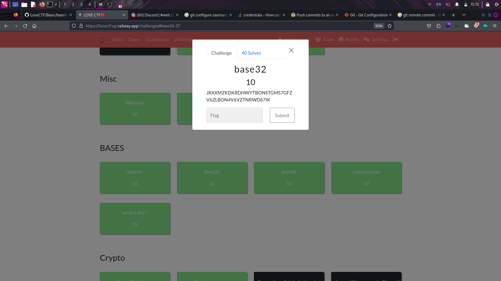
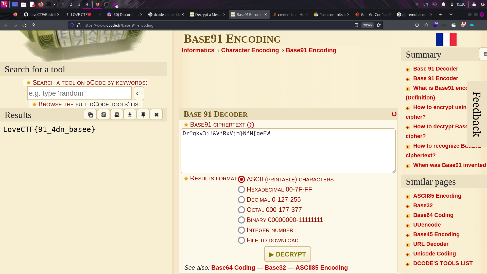
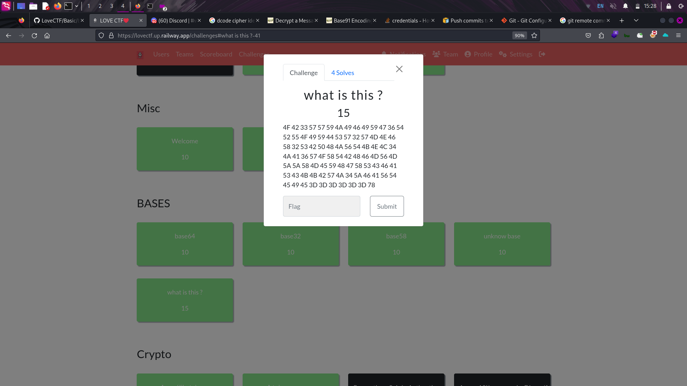

# basic challenges writups here

# chall name: base64


```bash
$ echo "TG92ZUNURntiYXNlNjRfMXNfZWFzeV9XM2xsP30K" | base64 -d
LoveCTF{base64_1s_easy_W3ll?}

```


# chall name: base32

```bash
$ echo "JRXXMZKDKRDHWYTBONSTGMS7GFZV6ZLBON4V6VZTNRWD67IK" | base32 -d
LoveCTF{base32_1s_easy_W3ll?}
```
# chall name: base58


```bash
$ echo "GKJeqdiYjUdzbosJB1M1HzYCH7eZmtfY1SaMj78Kj" | base58 -d
LoveCTF{base58_1s_easy_W3ll?}

```
# chall name: unknow base 


here i use dcode.com to identify the cipher and it told thad it was base91.
# cipher text: "Dr^gkv3j!&V*RxVjm}NfN[geEW"
i use dcode to decode the string.
# flag:  "LoveCTF{91_4dn_basee}"




# chall name: what is this 


we are given some hexadecimal value.
i use python to get  the plain text. 
```bash
$ python3
Python 3.11.7 (main, Dec  8 2023, 14:22:46) [GCC 13.2.0] on linux
Type "help", "copyright", "credits" or "license" for more information.
>>> text = """4F 42 33 57 57 59 4A 49 46 49 59 47 36 54 52 55 4F 49 59 44 53 57 32 57 4D 4E 46 58 32 53 42 50 48 4A 56 54 4B 4E 4C 34 4A 41 36 57 4F 58 54 42 48 46 4D 56 4D 5A 5A 58 4D 45 59 48 47 58 53 43 46 41 53 43 4B 4B 42 57 4A 34 5A 46 41 56 54 45 49 45 3D 3D 3D 3D 3D 3D 78""".replace(" ", '')
>>> text
'4F42335757594A4946495947365452554F495944535732574D4E465832534250484A56544B4E4C344A4136574F58544248464D564D5A5A584D45594847585343464153434B4B42574A345A464156544549453D3D3D3D3D3D78'
>>> bytes.fromhex(text)
b'OB3WWYJIFIYG6TRUOIYDSW2WMNFX2SBPHJVTKNL4JA6WOXTBHFMVMZZXMEYHGXSCFASCKKBWJ4ZFAVTEIE======x'
>>>
```
the plain text is: OB3WWYJIFIYG6TRUOIYDSW2WMNFX2SBPHJVTKNL4JA6WOXTBHFMVMZZXMEYHGXSCFASCKKBWJ4ZFAVTEIE======x

that is base32.
let decode it.
```bash
$ echo "OB3WWYJIFIYG6TRUOIYDSW2WMNFX2SBPHJVTKNL4JA6WOXTBHFMVMZZXMEYHGXSCFASCKKBWJ4ZFAVTEIE======" | base32 -d
pwka(*0oN4r09[VcK}H/:k55|H=g^a9YVg7a0s^B($%(6O2PVdA
```
so we got this encoded string: pwka(*0oN4r09[VcK}H/:k55|H=g^a9YVg7a0s^B($%(6O2PVdA

~ myabe basexx
