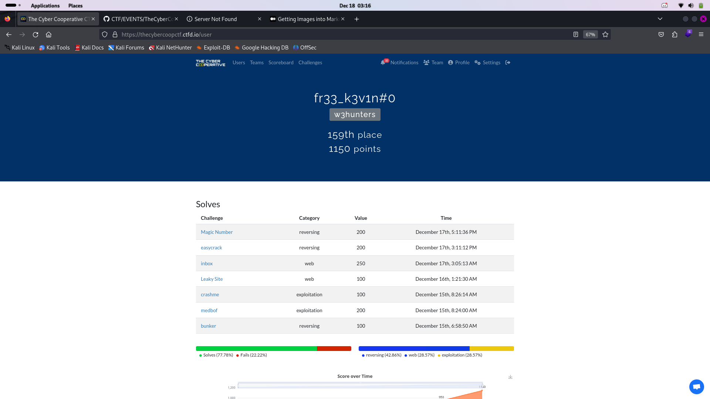

# hello and Welcome to the Cyber Cooperative's annual CTF event **writeup** !
Start: December 14th, 11:01:00 PM (Central Standard Time)
End: December 17th, 10:59:00 PM (Central Standard Time)

This is a jeopardy-style CTF with challenges across a variety of categories including web security, forensics, reverse engineering and cryptography.

so i participate to this event and i decide to make some writeup in order to explain what  i dit at this event .
let me do it in french in order to make explaination easy for me.  are you ok? my official langage is french 😅

