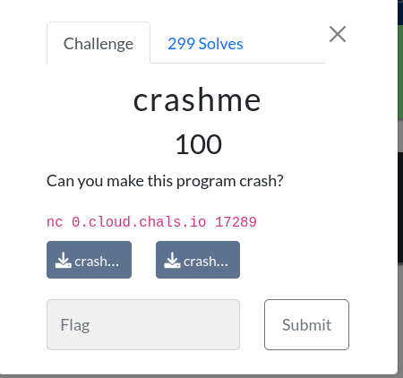
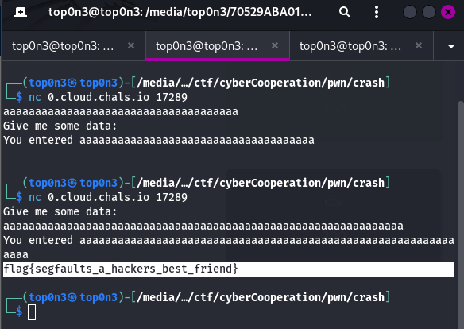

<br>
<br>
in this challenge, we are been given  C source code file and it compiled virsion.
```C
#include <stdio.h>
#include <string.h>
#include <stdlib.h>

int main(int argc, char *argv[]){
    char buffer[32];
    printf("Give me some data: \n");
    fflush(stdout);
    fgets(buffer, 64, stdin);
    printf("You entered %s\n", buffer);
    fflush(stdout);
    return 0;
}
```
by analyzing the source code, we can confirm that the program is vulnerable to BOF( buffer overflow)  at line 14.
the var buffer can only take 31 char plus the null byte.
but with the code at line 14, we can input more char than 32. 
so let contact the remote server and exploit the bof
<br>


so we get the flag:
# flag{segfaults_a_hackers_best_friend}

