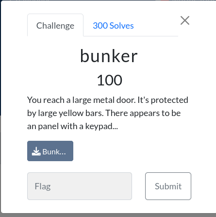
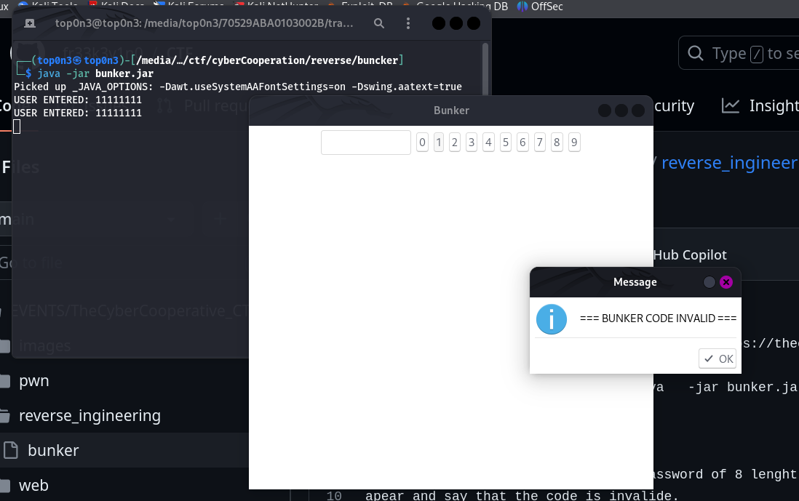
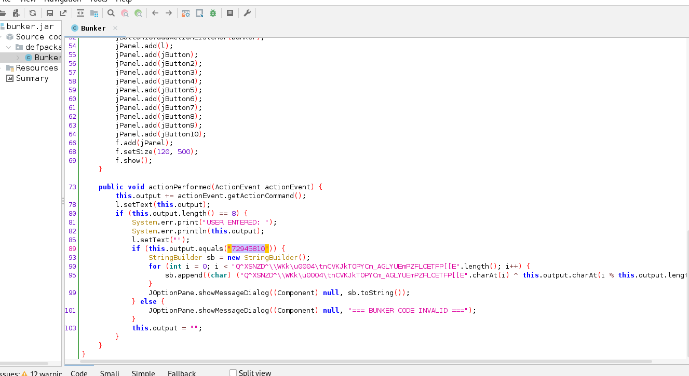

\\
 i download the file with this cmd: `` wget https://thecybercoopctf.ctfd.io/files/71ed55c2d32cd7f47afafb10b964ddcc/Bunker.jar?token=eyJ1c2VyX2lkIjoyNzUsInRlYW1faWQiOjE2NSwiZmlsZV9pZCI6MTN9.ZYA6Mw.wk-CgtHl7xTrWMf7dM9Cr7BWaoA -O buncker.jar
``
after execute the file with : `` jarva   -jar bunker.jar``, we get this.\
see image below.

\the  application ask to enter the password of 8 lenght. if i enter the invalide code, a popup menu
apear and say that the code is invalide.
a decompile the jar file by usig jadx-gui, we see at line  78, that after enter the password,
the application compart it to "72945810". if the user input password is egal to 72945810,
the application print the flag. otherwise it say that the code is invalide.\

so let enter "72945810" to get the flag.

so i get the flag. which is:
# flag{bunker_11_say_await_further_instructin}
