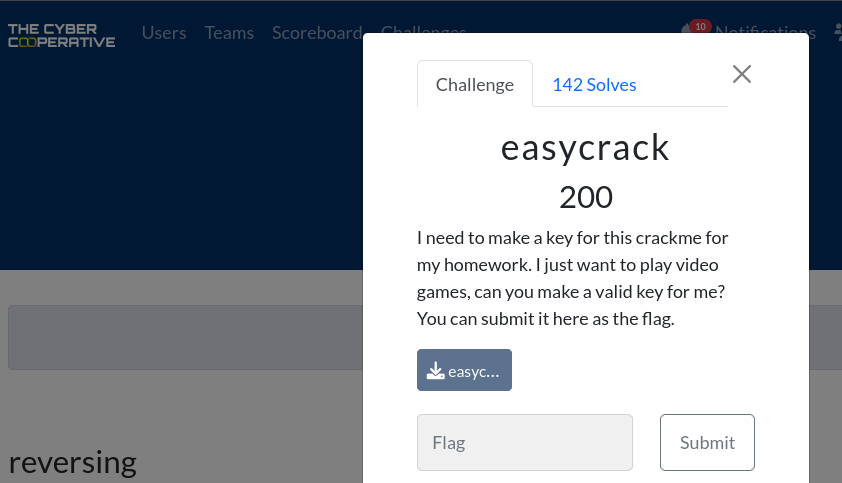
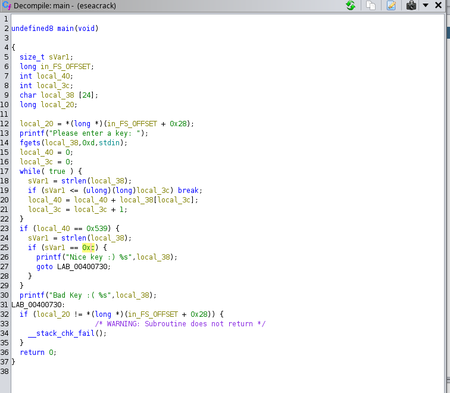
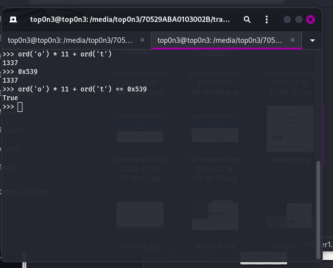
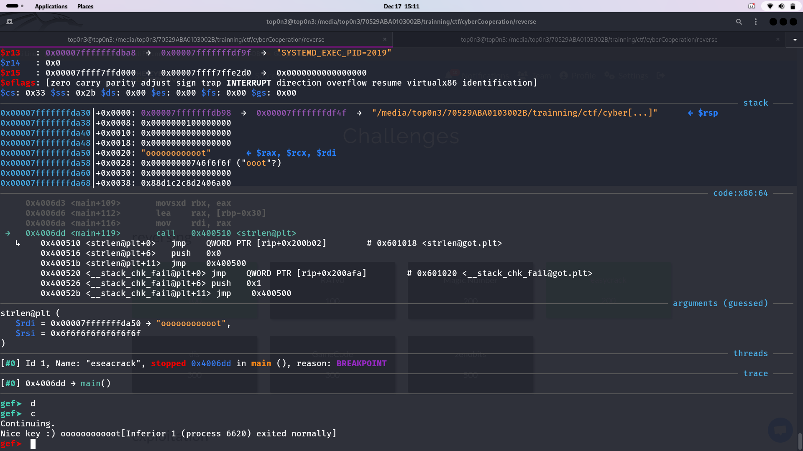

<br>
<br>
in this challenge, we are been given an ELF file
```bash
$ file eseacrack   
eseacrack: ELF 64-bit LSB executable, x86-64, version 1 (SYSV), dynamically linked, interpreter /lib64/ld-linux-x86-64.so.2, for GNU/Linux 2.6.32, BuildID[sha1]=9e2ef9c0697b3b9c323113e09e6b60af2c97b0ec, not stripped
```
i decompile the file using ghidra and this picture is one part of the decompiled code. 

<br>
like you can see, in order to get the flag, the input that we past to this application must 
respect two condition:
- the lenght must be 0xc (12)
-  the sum of the ascii code value of each char of the input must be equal to : 0x539 = 1337

after open my python termunal and make some calculus , i realise  that if i enter 'o' 11 time plus 'L'
that will satisfy the two condition.
ord('o') = 111; ord('t') = 116
111 * 11 + 116 == 1337





```bash
$ ./eseacrack
Please enter a key: ooooooooooot
Nice key :) ooooooooooot                                                                                
```
so we get the flag
