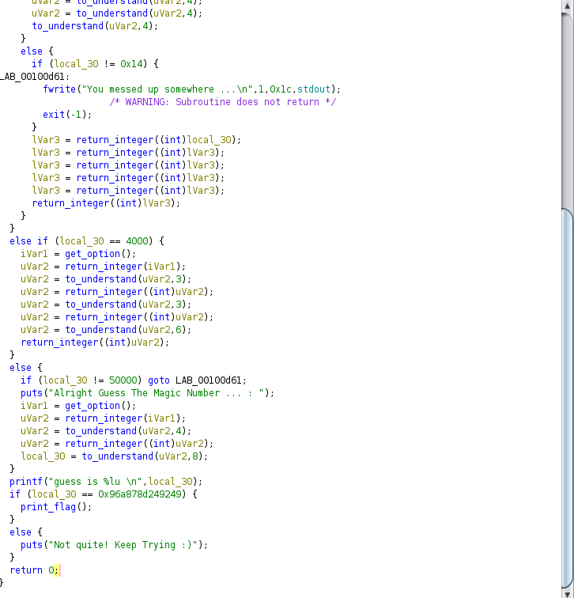
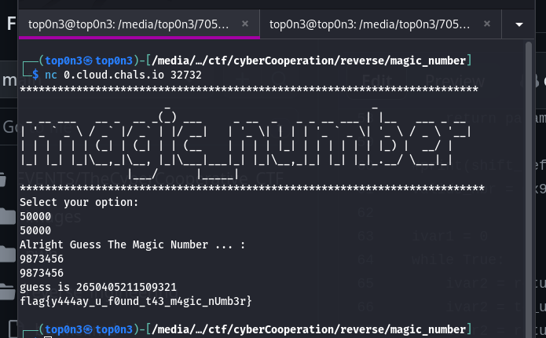

<br/>
<br/>
in this challenge, we are been given an ELF file. after analyzing and execute the file?.
i realise that  i need to enter a specific number in order to  trigger the application triger the flag.
first of all, i decompile the binary with ghidra and study the  different function  on it.
see the image below:


i can't show all the deompiled code. the picture above is one part of  the main function.
the part wich interrest me is this part:
```C
 else {
    if (local_30 != 50000) goto LAB_00100d61;
    puts("Alright Guess The Magic Number ... : ");
    iVar1 = get_option();
    uVar2 = return_integer(iVar1);
    uVar2 = to_understand(uVar2,4);
    uVar2 = return_integer((int)uVar2);
    local_30 = to_understand(uVar2,8);
  }
  printf("guess is %lu \n",local_30);
  if (local_30 == 0x96a878d249249) {
    print_flag();
  }
```
the name of functions which you see is not the original names. i renamed its in order to make comprehension easy.
so if i execute the elf file and enter 50000, the application will jump on this part.
in order to make things easy, i write somme python3 script  that with me the valide number which i will enter to get the flag. below is the script that i write.

```python
#let implement in python different functions in order to understand the programme

def shift_left_by_param2(param1:int, param2:int):
    for i in range(param2):
        param1 <<= 1
    return param1


def return_integer(param1:int):
    for i in range(0x11):
        param1 += 4
    return param1

def print_flag():
    with open("flag.txt",'r') as f:
        print(f.readlines())

def to_understande(param1:int, param2:int):
    local1 = 0
    if (param1 != 1) and  (param2 != 0):
        if (param1 & 1) == 0:
            param1 = to_understande(param1 >>1,  param2 - 1)
        else:
            local1 = shift_left_by_param2(param1, 3)
            param1 = to_understande(local1 +1, param2 - 1)

    return param1

#print(shift_left_by_param2(2, 4))
valide_nbr = 0x96a878d249249

ivar1 = 0
while True:
    ivar2 = return_integer(ivar1)
    ivar2 = to_understande(ivar2, 4)
    ivar2 = return_integer(ivar2)
    if  to_understande(ivar2, 8) == valide_nbr:
        print(f"fund {ivar1} ")
        break
    ivar1 += 1
```
it take long time for my script to get the number. \
finaly, the script give me this number 9873456. ok good 😅
so with all that information , i able to trigger the app print the flag.

let contact the remote server 
```
nc 0.cloud.chals.io 32732
```


so i get the flag. which is:
# flag{y444ay_u_f0und_t43_m4gic_nUmb3r}
**good** 😅

